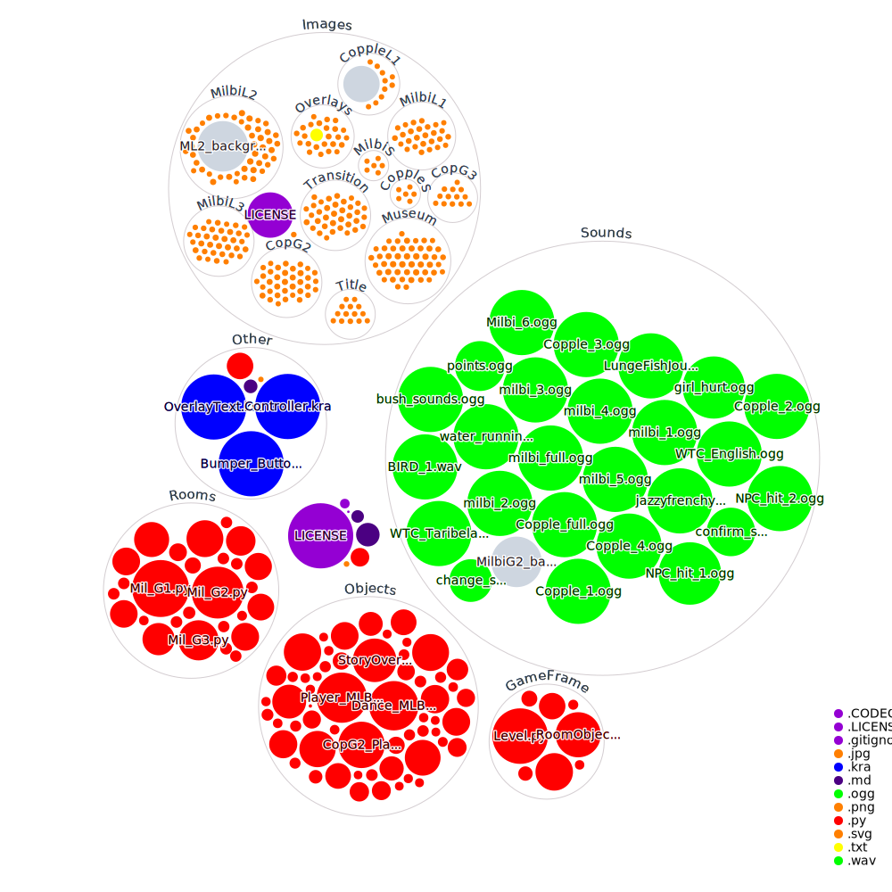

# Taribelang Project
The **Taribelang Bunda Student Project** is a student led project to build a real-world solution for a community need. 

Students selected on the basis of knowledge, skill and dedication, are offered the opportunity to work within a team to design and deliver a solution for a community need. Their project will be built for real world stakeholders and will be in use by the Bundaberg community long after they have completed the project. 

The client for this project will be a representative of the Taribelang Bunda Tribe.

Two subcomponents will be handled on GitHub:

- Graphics - The creation of the visuals for the project, including but not limited to: pixel art, animations, and visual effects. [Graphics repository](https://github.com/ShalomSTEM/graphics/)

- Software Engineering - Programming the project using Python and Pygame and the GameFrame API.

## Contributors
[View here](https://github.com/ShalomSTEM/TaribelangProject/blob/main/CONTRIBUTORS.md)
## How to contribute
> [View wiki](https://github.com/ShalomSTEM/TaribelangProject/wiki/)
## Links
 - [ShalomSTEM GitHub Profile](https://github.com/shalomstem)
 - [Shared Foldr (Private)](https://foldr.shalomcollege.com/home/shared/with-me/YGQOE)
## How to run
This project relies simply on the installation of **Python 3.8+** and **Pygame**.
> Note - these steps could change if we use PyInstaller
### Steps:
 - Install **Python 3.8+**
 - Install **Pygame** (_Recommended Method of Installation- pip install_)
 - Clone the GitHub repo
 - Run the **MainController.py** file 
## File structure

## License
The work here is licensed under the [GNU General Public License v3](https://github.com/ShalomSTEM/TaribelangProject/blob/main/LICENSE), with the graphics works being licensed under the [Creative Commons Zero v1 Universal License](https://github.com/ShalomSTEM/TaribelangProject/blob/main/Images/LICENSE)
